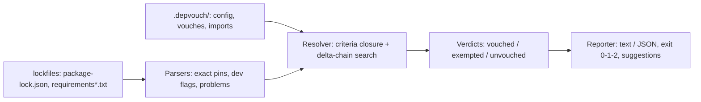

# depvouch

[English](README.md) | [中文](README.zh.md) | [日本語](README.ja.md)

[](LICENSE)   [](CONTRIBUTING.md)

**npm と PyPI のための cargo-vet —— リポジトリ内に置かれ CI で強制される、人間による依存関係レビューの台帳。スキャナーではなく、誰がどのパッケージバージョンを保証したかを記録し、保証をリポジトリ間で共有し、未レビューの追加をゲートで止める。**


```bash
# not yet on npm — install from a checkout of this repository
npm install && npm run build && npm pack
npm install -g ./depvouch-0.1.0.tgz
```

## なぜ depvouch？

世の中のスキャナーはどれも同じ問い――「この依存関係は既知の悪性データベースに一致するか？」――に答えるだけで、セキュリティレビューが本当に問うべきこと、すなわち*信頼できる人間がこのコードを読んだのか？*には誰も答えない。cargo-vet は、リポジトリ内の人手監査台帳が機能することを証明した：レビューは永続的で diff 可能な記録になり、アップグレードは差分レビューだけで済み、組織は監査作業を繰り返さず共有できる。しかし cargo-vet は Rust 専用であり、未レビューの追加が最も痛手となるのは npm と PyPI のエコシステムだ。depvouch は同じモデルを両方に持ち込む：誰がどの基準でどの正確なバージョンを保証したかを記録する、ソート済みプレーン JSON の `.depvouch/` ディレクトリ。フルレビュー + デルタレビューの連鎖でバージョンを認証するリゾルバ。あるチームのレビューが出所を保ったまま別リポジトリのゲートを満たすインポート/エクスポート機構。そしてロックされた依存関係に保証も明示的免除もない瞬間に CI を落とす `check` コマンド。`package-lock.json` と `requirements.txt` を直接読み、完全オフラインで動作し、ソケットを一切開かない。

|  | depvouch | cargo-vet | npm audit / pip-audit | Socket / Snyk 系スキャナー |
|---|---|---|---|---|
| データベース照合でなく*人間の判断*を記録 | はい | はい | いいえ —— CVE 照会 | いいえ —— ヒューリスティクスと CVE |
| エコシステム | npm + PyPI | Rust/crates.io | 自エコシステムのみ | 複数、SaaS 経由 |
| *未レビューの追加*で CI をゲート | はい、exit 1 | はい | いいえ —— 既知脆弱性のみ | 部分的、ポリシー駆動 |
| アップグレードのコスト | 差分のデルタレビュー | デルタレビュー | 対象外 | 対象外 |
| リポジトリ間でレビューを共有 | 出所付きのエクスポート/インポート | 共有 imports | いいえ | ベンダークラウド経由 |
| 記録の置き場所 | リポジトリにコミットされた JSON | コミットされた TOML | どこにもない | ベンダーのダッシュボード |
| ネットワークの要否 | 一切不要 | suggest はレジストリ取得 | 脆弱性 DB 取得 | ベンダー API |
| ランタイム依存 | 0 | （cargo 組み込み） | ツールチェーン同梱 | エージェント + クラウド |

<sub>各ツールの能力は公開ドキュメントに照らして確認、2026-07。</sub>

## 主な機能

- **スキャナーではなく台帳** —— 各エントリは、人間が正確なバージョンに対し基準を証明したもの：`誰が`、`いつ`、`何をレビューしたか`、自由記述のメモ付き。レビューは、人の入れ替わりやベンダーの盛衰を越えて残る監査可能な記録になる。
- **デルタ保証でアップグレードが安くなる** —— `minimist@1.2.6` を一度フルで保証すれば、`1.2.8` が来たとき読むのは diff だけ。認証チェーン（フル保証 + 端点の繋がるデルタ群、全リンクが要求基準を保持）は自動で解決される。
- **含意付きの基準** —— 組み込みの `safe-to-run` と `safe-to-deploy`（後者は前者を含意）、設定に書ける `crypto-reviewed` などのカスタム基準、パッケージ単位のポリシー上書き、開発専用依存への緩い要求。
- **保証はリポジトリ間を旅する** —— `depvouch export` があなたのレビューを出力し、`depvouch import --as acme-security` で別リポジトリでも有効になり、判定ごとに出所が記録される。一度レビューすれば、どこでもゲートに。
- **未レビューの部分に正直** —— `init` は免除を播種し、何かを読んだふりをせずにゲートを緑で開始する。`suggest` は最も安いレビューで免除を返済する道を計算し、`prune` は保証で覆われた免除を削除する。
- **厳格な入力、決定的な出力** —— ピン留めされていない要求や git/URL 参照はゲートを落とす（バージョン名を誰も言えないものは誰も保証できない）。レポートは実行間でバイト単位一致、`--format json` は機械向けの安定形。
- **ランタイム依存ゼロ、ネットワークゼロ** —— 素の Node.js がロックファイルと自前の台帳を読み、表示し、終了する。半日で読み切れるコード以外に信頼すべきものはない。

## クイックスタート

インストール：

```bash
# not yet on npm — install from a checkout of this repository
npm install && npm run build && npm pack
npm install -g ./depvouch-0.1.0.tgz
```

既存リポジトリへの導入——ゲートは緑から始まり、*新規*依存だけがレビューを要求する：

```bash
depvouch init          # exempts today's dependency set
depvouch check         # exit 0
```

誰かがレビューなしに依存を追加した。ゲートを実行する（同梱の `examples/webapp` がまさにこの状況）：

```bash
depvouch check examples/webapp
```

出力（実際の実行を採取）：

```text
depvouch: 2 lockfiles — package-lock.json (4 npm), requirements.txt (3 pypi)

UNVOUCHED (2)
  npm  minimist@1.2.8 — missing safe-to-deploy
       nearest certified version: 1.2.6 — review the 1.2.6 -> 1.2.8 diff
       fix: depvouch vouch minimist@1.2.8 --eco npm --from 1.2.6 --criteria safe-to-deploy --by <you>
  pypi requests@2.32.3 — missing safe-to-deploy
       no certified prior version — a full review is needed
       fix: depvouch vouch requests@2.32.3 --eco pypi --criteria safe-to-deploy --by <you>

depvouch: FAIL — 2 unvouched (4 vouched, 1 exempted, 2 unvouched)
```

終了コード 1 —— そのまま CI に入れられる。diff を読んでレビューを記録するか、別チームが済ませたレビューをインポートする：

```bash
depvouch vouch minimist@1.2.8 --from 1.2.6 --by alice --note "docs and test-only changes"
depvouch import org-vouches.json --as acme-security   # their reviews, your gate
depvouch check                                        # exit 0, provenance kept
```

その他のシナリオ（完全な播種済みサンプル、CI ゲートスクリプト）は [examples/](examples/README.md) に、ファイル形式は [docs/ledger-format.md](docs/ledger-format.md) にある。

## CLI リファレンス

`depvouch check` が既定のサブコマンド。各コマンドは `[dir]` または `--dir`（既定 `.`）に対して動作する。

| コマンド | 効果 |
|---|---|
| `init [dir]` | `.depvouch/` を作成し、現在の依存集合を免除する |
| `check [dir]` | ゲート：ロックされた全依存が保証済みまたは免除済みであること |
| `vouch <pkg>@<ver>` | レビューを記録：`--by`（必須）、`--criteria`、デルタは `--from`、`--note`、`--date` |
| `exempt <pkg>@<ver>` | 一つの正確なバージョンに判断抜きの通過を記録 |
| `suggest [dir]` | 全カバレッジへの最安レビュー——可能なら最寄りの認証済みバージョンからのデルタ |
| `list [dir]` | 台帳の一覧：パッケージ別の保証、免除、インポート元 |
| `import <file> --as <name>` / `export [dir]` | リポジトリ間で保証を共有、出所は保持 |
| `prune [dir] [--dry-run]` | 保証で覆われた、またはロックファイルから消えた免除を削除 |
| `explain <topic>` | オフラインドキュメント：`criteria`、`delta`、`exemptions`、`imports`、`ledger`、`exit-codes` |

check のフラグ：`--format text|json`、`--no-exemptions`（実カバレッジを見る）、`-q`。終了コード：`0` 合格、`1` 未保証の依存またはロックファイルの問題、`2` 用法・入力エラー——パイプラインは「依存が悪い」と「設定が悪い」を区別できる。

## アーキテクチャ



## ロードマップ

- [x] 2 エコシステム台帳（npm + PyPI）、デルタ連鎖解決、含意付き基準、出所付きインポート/エクスポート、免除の返済（`suggest`/`prune`）、JSON 出力付き 10 コマンド CLI（v0.1.0）
- [ ] 追加のロックファイル：`pnpm-lock.yaml`、`yarn.lock`、`poetry.lock`、`uv.lock`
- [ ] `depvouch diff <pkg> <a> <b>`：デルタレビューが読むべきレジストリ tarball の diff を直接開く
- [ ] 署名付き保証：minisign/ssh-keygen による台帳エントリの任意署名
- [ ] 組織横断の集約レジストリ：多数のエクスポートを一つの監査可能な信頼ストアに統合

全リストは [open issues](https://github.com/JaydenCJ/depvouch/issues) を参照。

## コントリビュート

コントリビューションを歓迎する。`npm install && npm run build` でビルドし、`npm test`（90 テスト）と `bash scripts/smoke.sh`（`SMOKE OK` を表示すること）を実行——このリポジトリは CI を同梱せず、上記の主張はすべてローカル実行で検証されている。[CONTRIBUTING.md](CONTRIBUTING.md) を読み、[good first issue](https://github.com/JaydenCJ/depvouch/issues?q=is%3Aissue+is%3Aopen+label%3A%22good+first+issue%22) を選ぶか、[ディスカッション](https://github.com/JaydenCJ/depvouch/discussions) を始めてほしい。

## ライセンス

[MIT](LICENSE)
