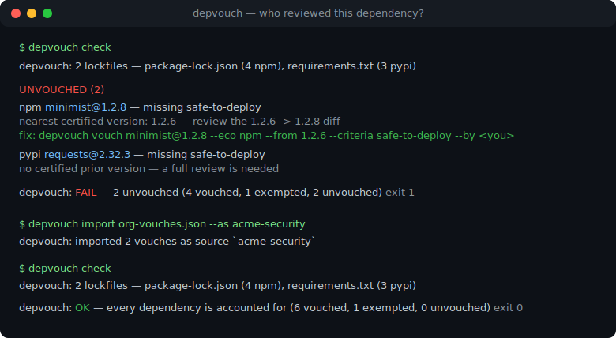
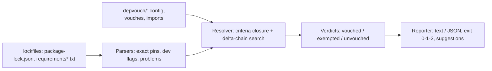

# depvouch

[English](README.md) | [中文](README.zh.md) | [日本語](README.ja.md)

[](LICENSE)   [](CONTRIBUTING.md)

**cargo-vet for npm and PyPI — an in-repo ledger of human dependency reviews, enforced in CI: not a scanner, it records who vouched for which package version, shares vouches across repos, and gates on unreviewed additions.**



```bash
# not yet on npm — install from a checkout of this repository
npm install && npm run build && npm pack
npm install -g ./depvouch-0.1.0.tgz
```

## Why depvouch?

Every scanner on the market answers the same question — "does this dependency match a known-bad database entry?" — and none of them answers the one your security review actually asks: *did a human we trust read this code?* cargo-vet proved that an in-repo ledger of human audits works: reviews become durable, diffable records, upgrades only need a diff review, and organizations share audit work instead of repeating it. But cargo-vet is Rust-only, and the ecosystems where unreviewed additions hurt most are npm and PyPI. depvouch brings the same model to both: a `.depvouch/` directory of plain sorted JSON that records who vouched for which exact package version against which criteria, a resolver that certifies versions through full-review + delta-review chains, an import/export mechanism so one team's reviews satisfy another repo's gate with provenance intact, and a `check` command that fails CI the moment a locked dependency has neither a vouch nor an explicit exemption. It reads `package-lock.json` and `requirements.txt` directly, runs fully offline, and never opens a socket.

|  | depvouch | cargo-vet | npm audit / pip-audit | Socket / Snyk-style scanners |
|---|---|---|---|---|
| Records *human judgment*, not database matches | yes | yes | no — CVE lookups | no — heuristics and CVEs |
| Ecosystems | npm + PyPI | Rust/crates.io | own ecosystem only | several, SaaS-mediated |
| Gates CI on *unreviewed additions* | yes, exit 1 | yes | no — only known vulns | partially, policy-driven |
| Upgrade cost | delta review of the diff | delta review | n/a | n/a |
| Shares reviews across repos | export/import with provenance | shared imports | no | via vendor cloud |
| Where the record lives | committed JSON in your repo | committed TOML | nowhere | vendor dashboard |
| Network required | none, ever | registry fetch for suggest | vuln DB fetch | vendor API |
| Runtime dependencies | 0 | (cargo built-in) | bundled with toolchain | agent + cloud |

<sub>Capability notes checked against each tool's public documentation, 2026-07.</sub>

## Features

- **A ledger, not a scanner** — every entry is a person certifying criteria for an exact version: `who`, `when`, `what was reviewed`, with a free-form note. Reviews become auditable records that survive employee turnover and vendor churn.
- **Delta vouches make upgrades cheap** — vouch `minimist@1.2.6` once in full; when `1.2.8` lands, review only the diff. Certification chains (full vouch + connecting deltas, every link carrying the required criterion) are resolved automatically.
- **Criteria with implication** — built-in `safe-to-run` and `safe-to-deploy` (which implies it), custom criteria like `crypto-reviewed` in config, per-package policy overrides, and weaker requirements for dev-only dependencies.
- **Vouches travel between repos** — `depvouch export` prints your reviews; `depvouch import --as acme-security` makes them count in another repo, with the origin recorded on every verdict. Review once, gate everywhere.
- **Honest about what is unreviewed** — `init` seeds exemptions so the gate starts green without pretending anything was read; `suggest` computes the cheapest reviews to burn them down; `prune` deletes the ones vouches now cover.
- **Strict inputs, deterministic outputs** — unpinned requirements and git/URL pins fail the gate (a version nobody can name is a version nobody can vouch for); reports are byte-identical across runs; `--format json` is a stable shape for machines.
- **Zero runtime dependencies, zero network** — plain Node.js, reads your lockfiles and its own ledger, prints, exits. Nothing to trust except the code you can read in an afternoon.

## Quickstart

Install:

```bash
# not yet on npm — install from a checkout of this repository
npm install && npm run build && npm pack
npm install -g ./depvouch-0.1.0.tgz
```

Adopt it in an existing repo — the gate starts green, only *new* dependencies need review:

```bash
depvouch init          # exempts today's dependency set
depvouch check         # exit 0
```

Someone adds a dependency without a review. Run the gate (the bundled `examples/webapp` is exactly this situation):

```bash
depvouch check examples/webapp
```

Output (real captured run):

```text
depvouch: 2 lockfiles — package-lock.json (4 npm), requirements.txt (3 pypi)

UNVOUCHED (2)
  npm  minimist@1.2.8 — missing safe-to-deploy
       nearest certified version: 1.2.6 — review the 1.2.6 -> 1.2.8 diff
       fix: depvouch vouch minimist@1.2.8 --eco npm --from 1.2.6 --criteria safe-to-deploy --by <you>
  pypi requests@2.32.3 — missing safe-to-deploy
       no certified prior version — a full review is needed
       fix: depvouch vouch requests@2.32.3 --eco pypi --criteria safe-to-deploy --by <you>

depvouch: FAIL — 2 unvouched (4 vouched, 1 exempted, 2 unvouched)
```

Exit code 1 — drop it into CI as-is. Record the review after reading the diff, or import the reviews another team already did:

```bash
depvouch vouch minimist@1.2.8 --from 1.2.6 --by alice --note "docs and test-only changes"
depvouch import org-vouches.json --as acme-security   # their reviews, your gate
depvouch check                                        # exit 0, provenance kept
```

More scenarios (the full seeded example, a CI gate script) live in [examples/](examples/README.md), and the file formats in [docs/ledger-format.md](docs/ledger-format.md).

## CLI reference

`depvouch check` is the default subcommand; every command works against `[dir]` or `--dir` (default `.`).

| Command | Effect |
|---|---|
| `init [dir]` | create `.depvouch/` and exempt the current dependency set |
| `check [dir]` | the gate: every locked dependency must be vouched or exempted |
| `vouch <pkg>@<ver>` | record a review: `--by` (required), `--criteria`, `--from` for deltas, `--note`, `--date` |
| `exempt <pkg>@<ver>` | record a judgment-free pass for one exact version |
| `suggest [dir]` | cheapest reviews for full coverage — delta from the closest certified version when possible |
| `list [dir]` | ledger inventory: vouches by package, exemptions, import sources |
| `import <file> --as <name>` / `export [dir]` | share vouches across repos, provenance preserved |
| `prune [dir] [--dry-run]` | drop exemptions now covered by vouches or gone from the lockfiles |
| `explain <topic>` | offline docs: `criteria`, `delta`, `exemptions`, `imports`, `ledger`, `exit-codes` |

Check flags: `--format text|json`, `--no-exemptions` (see real coverage), `-q`. Exit codes: `0` pass, `1` unvouched dependencies or lockfile problems, `2` usage or input error — so a pipeline can tell bad deps from a bad setup.

## Architecture



## Roadmap

- [x] Two-ecosystem ledger (npm + PyPI), delta-chain resolution, criteria with implication, import/export with provenance, exemption burn-down (`suggest`/`prune`), 10-command CLI with JSON output (v0.1.0)
- [ ] More lockfiles: `pnpm-lock.yaml`, `yarn.lock`, `poetry.lock`, `uv.lock`
- [ ] `depvouch diff <pkg> <a> <b>`: open the exact registry tarball diff a delta review should read
- [ ] Signed vouches: optional minisign/ssh-keygen signatures on ledger entries
- [ ] Aggregated org registries: merge many exports into one auditable trust store

See the [open issues](https://github.com/JaydenCJ/depvouch/issues) for the full list.

## Contributing

Contributions are welcome. Build with `npm install && npm run build`, then run `npm test` (90 tests) and `bash scripts/smoke.sh` (must print `SMOKE OK`) — this repository ships no CI, every claim above is verified by local runs. See [CONTRIBUTING.md](CONTRIBUTING.md), grab a [good first issue](https://github.com/JaydenCJ/depvouch/issues?q=is%3Aissue+is%3Aopen+label%3A%22good+first+issue%22), or start a [discussion](https://github.com/JaydenCJ/depvouch/discussions).

## License

[MIT](LICENSE)
