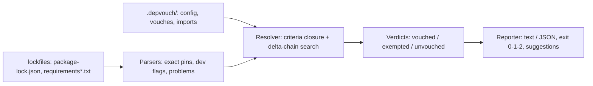

# depvouch

[English](README.md) | [中文](README.zh.md) | [日本語](README.ja.md)

[](LICENSE)   [](CONTRIBUTING.md)

**npm 与 PyPI 版的 cargo-vet —— 存放在仓库内、由 CI 强制执行的人工依赖评审台账：它不是扫描器，而是记录谁为哪个包版本作了担保，在仓库之间共享担保记录，并拦截未经评审的新增依赖。**


```bash
# not yet on npm — install from a checkout of this repository
npm install && npm run build && npm pack
npm install -g ./depvouch-0.1.0.tgz
```

## 为什么选择 depvouch？

市面上的每个扫描器都在回答同一个问题——"这个依赖是否命中已知恶意数据库的条目？"——却没有一个能回答安全评审真正要问的那个问题：*有没有我们信任的人读过这份代码？* cargo-vet 证明了仓库内人工审计台账的可行性：评审变成可持久、可 diff 的记录，升级只需评审差异，组织之间共享审计成果而不是重复劳动。但 cargo-vet 只服务 Rust，而未经评审的新增依赖伤害最大的生态恰恰是 npm 和 PyPI。depvouch 把同一模型带到这两个生态：一个由普通有序 JSON 组成的 `.depvouch/` 目录，记录谁按哪些准则为哪个精确包版本作保；一个通过"完整评审 + 差异评审"链条为版本颁发认证的解析器；一套导入/导出机制，让一个团队的评审在保留出处的前提下满足另一个仓库的门禁；还有一个 `check` 命令，一旦锁定的依赖既无担保也无显式豁免就让 CI 失败。它直接读取 `package-lock.json` 与 `requirements.txt`，完全离线运行，从不打开任何套接字。

|  | depvouch | cargo-vet | npm audit / pip-audit | Socket / Snyk 类扫描器 |
|---|---|---|---|---|
| 记录*人工判断*而非数据库匹配 | 是 | 是 | 否 —— CVE 查询 | 否 —— 启发式与 CVE |
| 生态 | npm + PyPI | Rust/crates.io | 仅自身生态 | 多个，经 SaaS 中转 |
| 对*未评审新增*做 CI 门禁 | 是，exit 1 | 是 | 否 —— 仅已知漏洞 | 部分，策略驱动 |
| 升级成本 | 只评审差异 | 差异评审 | 不适用 | 不适用 |
| 跨仓库共享评审 | 带出处的导入/导出 | 共享 imports | 否 | 经厂商云端 |
| 记录存放在哪 | 提交到仓库的 JSON | 提交到仓库的 TOML | 无处存放 | 厂商控制台 |
| 是否需要网络 | 永远不需要 | suggest 需访问 registry | 需拉取漏洞库 | 厂商 API |
| 运行时依赖 | 0 | （cargo 内置） | 随工具链捆绑 | agent + 云端 |

<sub>各工具能力说明核对自其公开文档，2026-07。</sub>

## 功能特性

- **台账，而非扫描器** —— 每条记录都是一个人按准则为精确版本作证：`谁`、`何时`、`评审了什么`，外加自由备注。评审成为经得起审计的记录，不因员工流动或厂商更迭而消失。
- **差异担保让升级变得便宜** —— 对 `minimist@1.2.6` 做一次完整担保；`1.2.8` 到来时只需评审 diff。认证链（完整担保 + 首尾相接的差异担保，每一环都携带所需准则）自动解析。
- **带蕴含关系的准则** —— 内置 `safe-to-run` 与 `safe-to-deploy`（后者蕴含前者），可在配置中定义 `crypto-reviewed` 等自定义准则，支持按包覆盖策略，并为仅开发用依赖放宽要求。
- **担保在仓库之间流动** —— `depvouch export` 打印你的评审；`depvouch import --as acme-security` 让它们在另一个仓库生效，每个判定都记录来源。评审一次，处处设防。
- **对未评审部分保持诚实** —— `init` 用豁免起步，让门禁先变绿而不假装读过任何代码；`suggest` 计算最省力的评审来逐步清偿；`prune` 删除已被担保覆盖的豁免。
- **严格输入，确定性输出** —— 未钉死的依赖与 git/URL 指针会使门禁失败（没人能说出版本号的东西也没人能作保）；报告在多次运行间逐字节一致；`--format json` 为机器提供稳定结构。
- **零运行时依赖，零网络** —— 纯 Node.js，读取你的锁文件和自己的台账，打印，退出。除了一个下午就能读完的代码，无需信任任何东西。

## 快速上手

安装：

```bash
# not yet on npm — install from a checkout of this repository
npm install && npm run build && npm pack
npm install -g ./depvouch-0.1.0.tgz
```

在既有仓库中采用——门禁从绿灯起步，只有*新增*依赖需要评审：

```bash
depvouch init          # exempts today's dependency set
depvouch check         # exit 0
```

有人未经评审加了依赖。运行门禁（自带的 `examples/webapp` 正是这种情形）：

```bash
depvouch check examples/webapp
```

输出（真实运行捕获）：

```text
depvouch: 2 lockfiles — package-lock.json (4 npm), requirements.txt (3 pypi)

UNVOUCHED (2)
  npm  minimist@1.2.8 — missing safe-to-deploy
       nearest certified version: 1.2.6 — review the 1.2.6 -> 1.2.8 diff
       fix: depvouch vouch minimist@1.2.8 --eco npm --from 1.2.6 --criteria safe-to-deploy --by <you>
  pypi requests@2.32.3 — missing safe-to-deploy
       no certified prior version — a full review is needed
       fix: depvouch vouch requests@2.32.3 --eco pypi --criteria safe-to-deploy --by <you>

depvouch: FAIL — 2 unvouched (4 vouched, 1 exempted, 2 unvouched)
```

退出码 1 —— 原样放进 CI 即可。读完 diff 后记录评审，或直接导入别的团队已完成的评审：

```bash
depvouch vouch minimist@1.2.8 --from 1.2.6 --by alice --note "docs and test-only changes"
depvouch import org-vouches.json --as acme-security   # their reviews, your gate
depvouch check                                        # exit 0, provenance kept
```

更多场景（完整的种子示例、CI 门禁脚本）见 [examples/](examples/README.md)，文件格式见 [docs/ledger-format.md](docs/ledger-format.md)。

## CLI 参考

`depvouch check` 是默认子命令；每个命令都可作用于 `[dir]` 或 `--dir`（默认 `.`）。

| 命令 | 作用 |
|---|---|
| `init [dir]` | 创建 `.depvouch/` 并豁免当前依赖集合 |
| `check [dir]` | 门禁：每个锁定依赖必须已担保或已豁免 |
| `vouch <pkg>@<ver>` | 记录评审：`--by`（必填）、`--criteria`、差异用 `--from`、`--note`、`--date` |
| `exempt <pkg>@<ver>` | 为一个精确版本记录不含判断的放行 |
| `suggest [dir]` | 达到全覆盖的最省力评审——尽可能从最近的已认证版本做差异 |
| `list [dir]` | 台账清单：按包分组的担保、豁免、导入来源 |
| `import <file> --as <name>` / `export [dir]` | 跨仓库共享担保，出处保留 |
| `prune [dir] [--dry-run]` | 删除已被担保覆盖或已不在锁文件中的豁免 |
| `explain <topic>` | 离线文档：`criteria`、`delta`、`exemptions`、`imports`、`ledger`、`exit-codes` |

check 选项：`--format text|json`、`--no-exemptions`（查看真实覆盖率）、`-q`。退出码：`0` 通过，`1` 存在未担保依赖或锁文件问题，`2` 用法或输入错误——流水线因此能区分"依赖有问题"与"配置有问题"。

## 架构



## 路线图

- [x] 双生态台账（npm + PyPI）、差异链解析、带蕴含的准则、带出处的导入/导出、豁免清偿（`suggest`/`prune`）、含 JSON 输出的 10 命令 CLI（v0.1.0）
- [ ] 更多锁文件：`pnpm-lock.yaml`、`yarn.lock`、`poetry.lock`、`uv.lock`
- [ ] `depvouch diff <pkg> <a> <b>`：直接打开差异评审应阅读的 registry tarball diff
- [ ] 签名担保：可选的 minisign/ssh-keygen 台账条目签名
- [ ] 组织级聚合注册表：把多份导出合并为一个可审计的信任库

完整列表见 [open issues](https://github.com/JaydenCJ/depvouch/issues)。

## 参与贡献

欢迎贡献。用 `npm install && npm run build` 构建，然后运行 `npm test`（90 个测试）和 `bash scripts/smoke.sh`（必须打印 `SMOKE OK`）——本仓库不附带 CI，以上每一项主张都由本地运行验证。参见 [CONTRIBUTING.md](CONTRIBUTING.md)，认领一个 [good first issue](https://github.com/JaydenCJ/depvouch/issues?q=is%3Aissue+is%3Aopen+label%3A%22good+first+issue%22)，或发起 [讨论](https://github.com/JaydenCJ/depvouch/discussions)。

## 许可证

[MIT](LICENSE)
